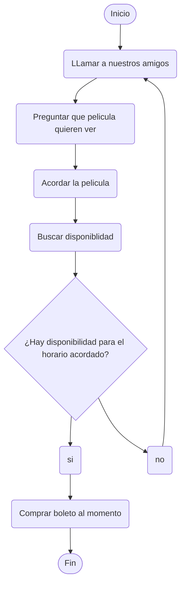

# Ejercicio 1: ir al cine

Representa en forma de diagrama de flujo el algoritmo de ir al cine con tus amigos

```mermaid
flowchart TD
    A([Inicio]) --> B
    B(LLamar a nuestros amigos) --> C
    C(Preguntar que pelicula quieren ver) --> D
    D(Acordar la pelicula) --> E
    E(Buscar disponiblidad) --> F
    F{¿Hay disponibilidad para el horario acordado?} --> G
    G(si) --> H
    H(Comprar boleto al momento)
    F --> I(no)
    I --> B
    H --> J([Fin])

```